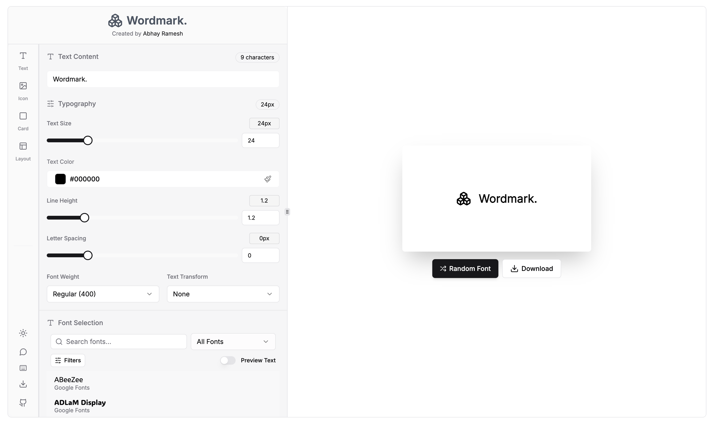
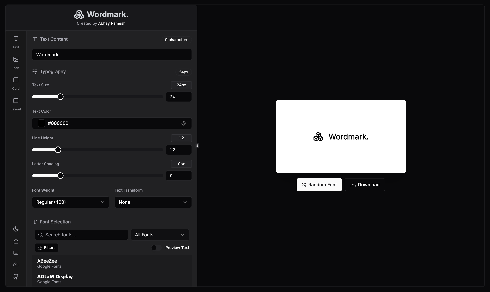

# Wordmark - Effortless Logo Design with Google Fonts & More

Welcome to Wordmark - your partner for creating logos with the ease of a pro and the heart of an entrepreneur. Experience it yourself by visiting our live demo at [wordmark.abhayramesh.com](https://wordmark.abhayramesh.com/)!

<a href="https://www.producthunt.com/posts/wordmark-7584b39f-f3da-41d9-aedf-18c59cf1228e?utm_source=badge-featured&utm_medium=badge&utm_souce=badge-wordmark&#0045;7584b39f&#0045;f3da&#0045;41d9&#0045;aedf&#0045;18c59cf1228e" target="_blank"></a>

## About Wordmark

Wordmark is a modern logo creation tool that helps entrepreneurs and developers quickly design logos using fonts from multiple providers including Google Fonts, Adobe Fonts, Font Squirrel, Font Source, and Open Foundry. With an intuitive interface, you can customize text, add icons, adjust colors, and download your logo in various formats.

Say goodbye to logo design headaches! Wordmark is here to simplify the process and empower entrepreneurs to create logos that truly represent their brand.

## Features

- **Multiple Font Providers**: Access fonts from Google, Adobe, Font Squirrel, Font Source, and Open Foundry
- **Customization Options**: Adjust text, colors, spacing, size, weight, and letter spacing
- **Icon Integration**: Add icons to your logo design
- **Export Options**: Download in PNG, SVG, or JPEG formats
- **Dark Mode Support**: Create in light or dark mode according to your preference
- **Version History**: Track and revert to previous designs
- **Layout Options**: Various text and icon layout arrangements
- **Keyboard Shortcuts**: Speed up your workflow with convenient shortcuts
- **Command Palette**: Quick access to all features
- **Random Font Selection**: Discover new fonts with one click

## Why Choose Wordmark?

- **Font Variety Galore:** Dive into a world of fonts from multiple providers. Find the one that resonates with your brand's personality and style.
- **Entrepreneur's Delight:** Whether you're a seasoned entrepreneur or just starting, Wordmark caters to your logo needs. No complicated tools, no designer background required!
- **User-Friendly Magic:** No steep learning curves. No design jargon. Just a straightforward, intuitive interface that helps you bring your brand to life.

## Try It Out

Ready to dive in? Go straight to our website and start crafting your logo today: [wordmark.abhayramesh.com](https://wordmark.abhayramesh.com/)

<div style="display:flex;">
  
</div>

## Development Setup

```bash
# Clone the repository
git clone https://github.com/abhay-ramesh/wordmark.git
cd wordmark

# Install dependencies
npm install

# Start the development server
npm run dev
```

Open [http://localhost:3000](http://localhost:3000) to see the application.

## Technologies

- **Frontend**: Next.js, React, TypeScript
- **Styling**: Tailwind CSS, shadcn/ui components
- **State Management**: Jotai
- **Data Fetching**: React Query
- **Font Integration**: Multiple APIs including Google Fonts
- **Export**: html-to-image for rendering designs

## Project Structure

- `app/` - Next.js application files and page components
- `components/` - Reusable React components
- `lib/` - Utility functions and state management
- `lib/fontProviders/` - Integration with different font providers
- `public/` - Static assets
- `components/ui/` - UI components from shadcn/ui

## How to Use

1. Visit [wordmark.abhayramesh.com](https://wordmark.abhayramesh.com/)
2. Enter your text in the editor
3. Select a font from any of the providers
4. Customize colors, spacing, and layout
5. Add an icon if desired
6. Download your logo in your preferred format

## Contributing

We welcome contributions! Please see our [Contributing Guidelines](CONTRIBUTING.md) for details on how to submit pull requests, report issues, and suggest enhancements.

## Join the Journey

We're all about the entrepreneurial spirit. If you're as passionate as we are, jump in! Share your ideas, let us know your thoughts, and be part of the Wordmark community.

## License

This project is licensed under the MIT License - see the [LICENSE](LICENSE) file for details.

## Star History

<a href="https://star-history.com/#abhay-ramesh/Wordmark&Timeline">
  <picture>
    <source media="(prefers-color-scheme: dark)" srcset="https://api.star-history.com/svg?repos=abhay-ramesh/Wordmark&type=Timeline&theme=dark" />
    <source media="(prefers-color-scheme: light)" srcset="https://api.star-history.com/svg?repos=abhay-ramesh/Wordmark&type=Timeline" />
    
  </picture>
</a>

## ❤️ Acknowledgements

Thanks to all the people who contributed to Wordmark~

<a href="https://github.com/abhay-ramesh/Wordmark/graphs/contributors">
  
</a>

---

Crafted with 💡 for entrepreneurs by the Wordmark Team.
