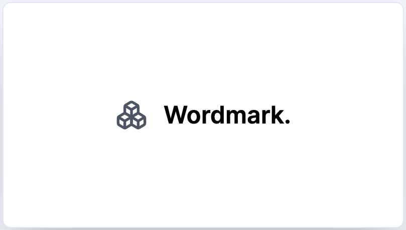

# Wordmark - Effortless Logo Design with Google Fonts

Welcome to Wordmark - your companion for creating logos with the ease of a pro and the heart of an entrepreneur.

## Introducing Wordmark

Say goodbye to logo design headaches! Wordmark is here to simplify the process and empower entrepreneurs to create logos that truly represent their brand.

## Why Choose Wordmark?

- **Google Fonts Galore:** Dive into a world of fonts from Google's collection. Find the one that resonates with your brand's personality and style.

- **Entrepreneur's Delight:** Whether you're a seasoned entrepreneur or just starting, Wordmark caters to your logo needs. No complicated tools, no designer background required!

- **User-Friendly Magic:** No steep learning curves. No design jargon. Just a straightforward, intuitive interface that helps you bring your brand to life.

## Getting Started

1. **Clone the Repo:** Visit our repository and clone it to your workspace.

2. **Installation:** Follow the setup instructions. Think of it like preparing the canvas for your masterpiece.

3. **Unleash Your Brand:** Open Wordmark, explore the array of Google Fonts, and watch your brand vision take shape effortlessly.

## Join the Journey

We're all about the entrepreneurial spirit. If you're as passionate as we are, jump in! Share your ideas, let us know your thoughts, and be part of the Wordmark community.

## Spread the Word

Have fellow entrepreneurs in your circle? Let them know about Wordmark. It's the secret ingredient to a standout brand identity.

## Licensing

Wordmark operates under the [Entrepreneur's License](LICENSE.md). Feel free to customize, adapt, and thrive with it.

---

Crafted with 💡 for entrepreneurs by the Wordmark Team.
